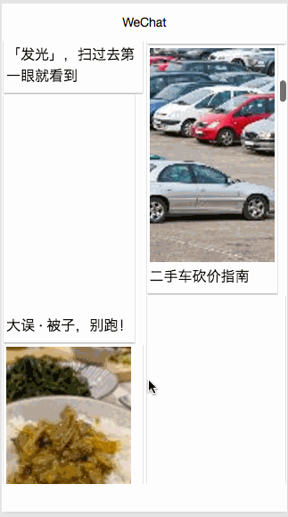

# WxMasonry
WxMasonry-微信小程序瀑布流布局模式

## 来源
[微信小程序开发论坛](http://weappdev.com/)
垂直微信小程序开发交流论坛


## 效果



## github地址

[WxMasonry-微信小程序实现瀑布流布局 https://github.com/icindy/WxMasonry](https://github.com/icindy/WxMasonry)


## 先提一个问题，以免你们不看到最后

**在微信小程序的循环列表中，如何实现图片的等比例缩放，这件事上我有尝试，但是效果不佳，欢迎交流解决方案！！**

## 实现方式

> 虽然实现方式很简单，但是我起初没有想到，也是绕了很远的路才想到。当你看到下面的解决方案的时候，请不要说我sb，因为我确实是没有想起来，太久没有学习前端知识，很多属性基本没有见过。

* 使用css3的`column-＊`属性
  + column-width
  + column-count
  + column-gap

> 如果熟悉css3的朋友可能一下子就想起来了，但是我并没有 我是绕了一大圈才想起来

* 实现方式

```
.WxMasonryView{
  column-count:2;
  column-gap: 10px;
  width: 100%;
}
.WxMasonry{
  width: 95%;
  background: #fefefe;
  border: 2px solid #fcfcfc;
  box-shadow: 0 1px 2px rgba(34, 25, 25, 0.4);
  margin: 5px 2px 2px 2px;
  padding: 1px;
  padding-bottom: 5px;
  transition: opacity .4s ease-in-out;
  display: inline-block;
}
```

column-count： 用于分割几列,这样你就可以通过直接设置几列，而不用担心屏幕宽度，当然这里有个坑哈，就是图片自适应！

column-gap: 间距不提。

> 至于几个属性的使用，建议自己w3c一下
 
## 心酸历程

> 实际上在着手做瀑布流的时候，我想到过纯css的的方法，但是我没有看到过column-＊属性，因为已经很久没有再次学习css了。

* 为什么会首先考虑纯css路线
原因很简单，微信小程序没有dom操作，如果按照常规的路线是无法实现的。纯float是不科学的，因为，你自己可以尝试，float达不到瀑布流的间隙插针的效果。

* 常规的瀑布流实现方式
前端工程师看到瀑布流的时候，会想到很对js库，或者jquery库，这些库的实现原理大同小异，基本上都是使用了“绝对定位”进行计算布局。

* 我的弯路
我毫不犹豫的想要按照常规的瀑布实现方式，但是没有办法实现那么多dom层级嵌套计算，所以想了很久没有想通，才跳回到纯css路线的，后面搜索发现了column-＊属性，所以才浪费了很长时间。

## 总结

既然微信小程序没有Dom操作，可以通过css3的很多属性来解决一些问题。

## 来源
[微信小程序开发论坛](http://weappdev.com/)
垂直微信小程序开发交流论坛


